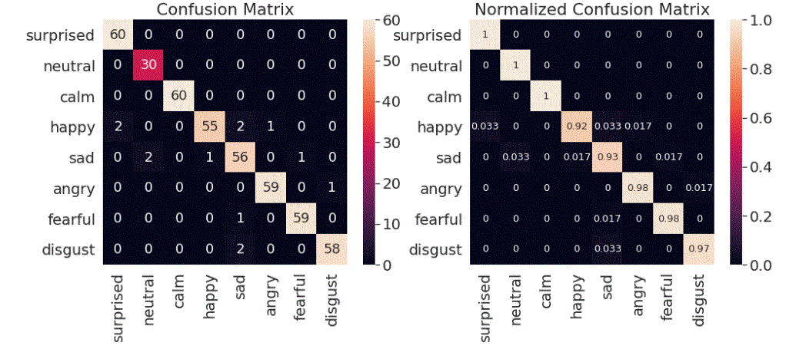

# Parallel is All You Want: Combining Spatial and Temporal Feature Representions of Speech Emotion by Parallelizing CNNs and Transformer-Encoders
### Code and explanations, see notebook: [nbviewer](https://nbviewer.jupyter.org/github/IliaZenkov/transformer_cnn_parallel_audio_classification/blob/main/notebooks/Parallel_is_All_You_Want.ipynb)

|  80.44% Accuracy     |       |
|---------------------------|------------------|
  | |

# Abstract
In this notebook, I'm going to build upon my Intro to Speech Audio Classification repo and build two parallel convolutional neural networks (CNN) in parallel with a Transformer encoder network to classify audio data. We're working on the RAVDESS dataset to classify emotions from one of 8 classes. We combine the CNN for spatial feature representation and the Transformer for temporal feature representation. We augment the training data by increasing variation in the dataset to reduce overfitting; we use Additive White Gaussian Noise (AWGN) to augment the RAVDESS dataset three-fold for a total of 4320 audio samples.

We harness the image-classification and spatial feature representation power of the CNN by treating mel spectrograms as grayscale images; their width is a time scale, their height is a frequency scale. The value of each pixel in the mel spectrogram is the intensity of the audio signal at a particular mel frequency at a time step.

Because of the sequential nature of the data, we will also use the Transformer to try and model as accurately as possible the temporal relationships between pitch transitions in emotions.

This notebook takes inspirations from a variety of recent advances in deep learning and network architectures; in particular, stacked and parallel CNN networks combined with multi-head self-attention layers from the Transformer Encoder. I hypothesize that the expansion of CNN filter channel dimensions and reduction of feature maps will provide the most expressive feature representation at the lowest computaitonal cost, while the Transformer-Encoder is used with the hypothesis that the network will learn to predict frequency distributions of different emotions according to the global structure of the mel spectrogram of each emotion. With the strength of the CNN in spatial feature representation and Transformer in sequence encoding, I manage to achieve a 80.44% accuracy on a hold-out test set from the RAVDESS dataset.

<!--TABLE OF CONTENTS-->
# Table of Contents
- [Introduction](https://nbviewer.jupyter.org/github/IliaZenkov/transformer_cnn_parallel_audio_classification/blob/main/notebooks/Parallel_is_All_You_Want.ipynb#Introduction)
  - [Define features](https://nbviewer.jupyter.org/github/IliaZenkov/transformer_cnn_parallel_audio_classification/blob/main/notebooks/Parallel_is_All_You_Want.ipynb#Define-features)
  - [Load Data and Extract Features](https://nbviewer.jupyter.org/github/IliaZenkov/transformer_cnn_parallel_audio_classification/blob/main/notebooks/Parallel_is_All_You_Want.ipynb#Load-Data-and-Extract-Features)
  - [Split into Train/Validation/Test Sets](https://nbviewer.jupyter.org/github/IliaZenkov/transformer_cnn_parallel_audio_classification/blob/main/notebooks/Parallel_is_All_You_Want.ipynb#Split-into-Train/Validation/Test-Sets)
  - [Augmenting the Data with AWGN: Additive White Gaussian Noise](https://nbviewer.jupyter.org/github/IliaZenkov/transformer_cnn_parallel_audio_classification/blob/main/notebooks/Parallel_is_All_You_Want.ipynb#Augmenting-the-Data-with-AWGN---Additive-White-Gaussian-Noise)
  - [Format Data into Tensor-Ready 4D Arrays](https://nbviewer.jupyter.org/github/IliaZenkov/transformer_cnn_parallel_audio_classification/blob/main/notebooks/Parallel_is_All_You_Want.ipynb#Format-Data-into-Tensor-Ready-4D-Arrays)
  - [Feature Scaling](https://nbviewer.jupyter.org/github/IliaZenkov/transformer_cnn_parallel_audio_classification/blob/main/notebooks/Parallel_is_All_You_Want.ipynb#Feature-Scaling)
  - [Save and Reload Data as NumPy Arrays](https://nbviewer.jupyter.org/github/IliaZenkov/transformer_cnn_parallel_audio_classification/blob/main/notebooks/Parallel_is_All_You_Want.ipynb#Save-and-Reload-Data-as-NumPy-Arrays)
- [Architecture Overview](https://nbviewer.jupyter.org/github/IliaZenkov/transformer_cnn_parallel_audio_classification/blob/main/notebooks/Parallel_is_All_You_Want.ipynb#Architecture-Overview)
- [CNN Motivation](https://nbviewer.jupyter.org/github/IliaZenkov/transformer_cnn_parallel_audio_classification/blob/main/notebooks/Parallel_is_All_You_Want.ipynb#CNN-Motivation)
- [Transformer-Encoder Motivation](https://nbviewer.jupyter.org/github/IliaZenkov/transformer_cnn_parallel_audio_classification/blob/main/notebooks/Parallel_is_All_You_Want.ipynb#Transformer-Encoder-Motivation)
- [Building Model Architecture and Forward Pass](https://nbviewer.jupyter.org/github/IliaZenkov/transformer_cnn_parallel_audio_classification/blob/main/notebooks/Parallel_is_All_You_Want.ipynb#Build-Model-Architecture-and-Define-Forward-Pass)
  - [Analyzing The Flow of Tensors Through the Network](https://nbviewer.jupyter.org/github/IliaZenkov/transformer_cnn_parallel_audio_classification/blob/main/notebooks/Parallel_is_All_You_Want.ipynb#Analyzing-The-Flow-of-Tensors-Through-the-Network)
  - [Choosing Loss Function](https://nbviewer.jupyter.org/github/IliaZenkov/transformer_cnn_parallel_audio_classification/blob/main/notebooks/Parallel_is_All_You_Want.ipynb#Define-Loss/Criterion)
  - [Choosing Optimizer](https://nbviewer.jupyter.org/github/IliaZenkov/transformer_cnn_parallel_audio_classification/blob/main/notebooks/Parallel_is_All_You_Want.ipynb#Choose-Optimizer)
  - [Build Training Step](https://nbviewer.jupyter.org/github/IliaZenkov/transformer_cnn_parallel_audio_classification/blob/main/notebooks/Parallel_is_All_You_Want.ipynb#Define-Training-Step)
  - [Build Validation Step](https://nbviewer.jupyter.org/github/IliaZenkov/transformer_cnn_parallel_audio_classification/blob/main/notebooks/Parallel_is_All_You_Want.ipynb#Define-Validation-Step)
  - [Make Checkpoint Functions](https://nbviewer.jupyter.org/github/IliaZenkov/transformer_cnn_parallel_audio_classification/blob/main/notebooks/Parallel_is_All_You_Want.ipynb#Make-Checkpoint-Functions)
- [Build Training Loop](https://nbviewer.jupyter.org/github/IliaZenkov/transformer_cnn_parallel_audio_classification/blob/main/notebooks/Parallel_is_All_You_Want.ipynb#Build-Training-Loop)
  - [Train Model](https://nbviewer.jupyter.org/github/IliaZenkov/transformer_cnn_parallel_audio_classification/blob/main/notebooks/Parallel_is_All_You_Want.ipynb#Train-Model)
- [Check the Loss Curve's Behaviour](https://nbviewer.jupyter.org/github/IliaZenkov/transformer_cnn_parallel_audio_classification/blob/main/notebooks/Parallel_is_All_You_Want.ipynb#Check-the-Loss-Curve's-Behaviour)
- [Evaluate Performance on Hold-Out Test Set](https://nbviewer.jupyter.org/github/IliaZenkov/transformer_cnn_parallel_audio_classification/blob/main/notebooks/Parallel_is_All_You_Want.ipynb#Evaluate-the-Model-on-Hold-Out-Test-Set)
- [Conclusion](https://nbviewer.jupyter.org/github/IliaZenkov/transformer_cnn_parallel_audio_classification/blob/main/notebooks/Parallel_is_All_You_Want.ipynb#Conclusion)
- [References](https://nbviewer.jupyter.org/github/IliaZenkov/transformer_cnn_parallel_audio_classification/blob/main/notebooks/Parallel_is_All_You_Want.ipynb#References)

# Appendices
- [Appendix A: Convolutional Neural Nets Dissected](https://nbviewer.jupyter.org/github/IliaZenkov/transformer_cnn_parallel_audio_classification/blob/main/notebooks/Parallel_is_All_You_Want.ipynb#Appendix-A---Convolutional-Neural-Nets-Dissected)
  - [Kernels and Filters](https://nbviewer.jupyter.org/github/IliaZenkov/transformer_cnn_parallel_audio_classification/blob/main/notebooks/Parallel_is_All_You_Want.ipynb#Kernels-and-Filters)
  - [Zero Padding](https://nbviewer.jupyter.org/github/IliaZenkov/transformer_cnn_parallel_audio_classification/blob/main/notebooks/Parallel_is_All_You_Want.ipynb#Zero-Padding)
  - [Max Pooling](https://nbviewer.jupyter.org/github/IliaZenkov/transformer_cnn_parallel_audio_classification/blob/main/notebooks/Parallel_is_All_You_Want.ipynb#Max-Pooling)
  - [Regularization Using Dropout and a note on Pruning](https://nbviewer.jupyter.org/github/IliaZenkov/transformer_cnn_parallel_audio_classification/blob/main/notebooks/Parallel_is_All_You_Want.ipynb#Regularization-Using-Dropout-and-a-note-on-Pruning)
  - [Batch Normalization and Optimizing the Optimization Landsape](https://nbviewer.jupyter.org/github/IliaZenkov/transformer_cnn_parallel_audio_classification/blob/main/notebooks/Parallel_is_All_You_Want.ipynb#Batch-Normalization-and-Optimizing-the-Optimization-Landsape)
  - [ReLU: Non-Saturated Activations are Healthier (for CNNs)](https://nbviewer.jupyter.org/github/IliaZenkov/transformer_cnn_parallel_audio_classification/blob/main/notebooks/Parallel_is_All_You_Want.ipynb#ReLU---Non-Saturated-Activations-are-Healthier-[for-CNNs])
  - [Turning Feature Maps into Probabilities with a Fully Connected Layer](https://nbviewer.jupyter.org/github/IliaZenkov/transformer_cnn_parallel_audio_classification/blob/main/notebooks/Parallel_is_All_You_Want.ipynb#Turning-Feature-Maps-into-Probabilities-with-a-Fully-Connected-Layer)
- [Appendix B: The Transformer](https://nbviewer.jupyter.org/github/IliaZenkov/transformer_cnn_parallel_audio_classification/blob/main/notebooks/Parallel_is_All_You_Want.ipynb#Appendix-B---The-Transformer)
    - [Self-Attention](https://nbviewer.jupyter.org/github/IliaZenkov/transformer_cnn_parallel_audio_classification/blob/main/notebooks/Parallel_is_All_You_Want.ipynb#Self-Attention)
    - [Multi-Head Self-Attention](https://nbviewer.jupyter.org/github/IliaZenkov/transformer_cnn_parallel_audio_classification/blob/main/notebooks/Parallel_is_All_You_Want.ipynb#Multi-Head-Self-Attention)
    - [Transformer Architecture](https://nbviewer.jupyter.org/github/IliaZenkov/transformer_cnn_parallel_audio_classification/blob/main/notebooks/Parallel_is_All_You_Want.ipynb#Transformer-Architecture)
        - [Input](https://nbviewer.jupyter.org/github/IliaZenkov/transformer_cnn_parallel_audio_classification/blob/main/notebooks/Parallel_is_All_You_Want.ipynb#Input)
        - [Encoder](https://nbviewer.jupyter.org/github/IliaZenkov/transformer_cnn_parallel_audio_classification/blob/main/notebooks/Parallel_is_All_You_Want.ipynb#Encoder)
        - [Decoder](https://nbviewer.jupyter.org/github/IliaZenkov/transformer_cnn_parallel_audio_classification/blob/main/notebooks/Parallel_is_All_You_Want.ipynb#Decoder)
        - [Output](https://nbviewer.jupyter.org/github/IliaZenkov/transformer_cnn_parallel_audio_classification/blob/main/notebooks/Parallel_is_All_You_Want.ipynb#Output)
- [Appendix C: From Autoencoders to LSTMs to Attention](https://nbviewer.jupyter.org/github/IliaZenkov/transformer_cnn_parallel_audio_classification/blob/main/notebooks/Parallel_is_All_You_Want.ipynb#Appendix-C---From-Autoencoders-to-LSTMs-to-Attention)
  - [Autoencoders](https://nbviewer.jupyter.org/github/IliaZenkov/transformer_cnn_parallel_audio_classification/blob/main/notebooks/Parallel_is_All_You_Want.ipynb#Autoencoders)
  - [The Sparse Autoencoder](https://nbviewer.jupyter.org/github/IliaZenkov/transformer_cnn_parallel_audio_classification/blob/main/notebooks/Parallel_is_All_You_Want.ipynb#The-Sparse-Autoencoder)
  - [The Variational Autoencoder, Decoders, and Latent Space](https://nbviewer.jupyter.org/github/IliaZenkov/transformer_cnn_parallel_audio_classification/blob/main/notebooks/Parallel_is_All_You_Want.ipynb#The-Variational-Autoencoder,-Decoders,-and-Latent-Space)
  - [The RNN, Seq2Seq, and Gradient Problems](https://nbviewer.jupyter.org/github/IliaZenkov/transformer_cnn_parallel_audio_classification/blob/main/notebooks/Parallel_is_All_You_Want.ipynb#The-RNN,-Seq2Seq,-and-Gradient-Problems)
  - [The LSTM Cell](https://nbviewer.jupyter.org/github/IliaZenkov/transformer_cnn_parallel_audio_classification/blob/main/notebooks/Parallel_is_All_You_Want.ipynb#The-LSTM-Cell)
  - [Bidirectional RNN](https://nbviewer.jupyter.org/github/IliaZenkov/transformer_cnn_parallel_audio_classification/blob/main/notebooks/Parallel_is_All_You_Want.ipynb#Bidirectional-RNN)
  - [The Attention Mechanism](https://nbviewer.jupyter.org/github/IliaZenkov/transformer_cnn_parallel_audio_classification/blob/main/notebooks/Parallel_is_All_You_Want.ipynb#The-Attention-Mechanism)
- [Appendix D: Supplementary Notes](https://nbviewer.jupyter.org/github/IliaZenkov/transformer_cnn_parallel_audio_classification/blob/main/notebooks/Parallel_is_All_You_Want.ipynb#Appendix-D---Supplementary-Notes)
  - [More CNN Kernel/Filter Math](https://nbviewer.jupyter.org/github/IliaZenkov/transformer_cnn_parallel_audio_classification/blob/main/notebooks/Parallel_is_All_You_Want.ipynb#More-CNN-Kernel/Filter-Math)
  - [Smoothing the Optimization Surface](https://nbviewer.jupyter.org/github/IliaZenkov/transformer_cnn_parallel_audio_classification/blob/main/notebooks/Parallel_is_All_You_Want.ipynb#Smoothing-the-Optimization-Surface)

# References
- Ba et al, 2016. Layer Normalization. https://arxiv.org/abs/1607.06450
- Bahdanau et al, 2015. https://arxiv.org/pdf/1409.0473.pdf
- Cheng et al, 2016. Long Short-Term Memory-Networks for Machine Reading. https://arxiv.org/pdf/1601.06733.pdf
- He et al, 2015. Deep Residual Learning for Image Recognition. https://arxiv.org/abs/1512.03385
- Ioffe, Szegedy, 2015. Batch Normalization: Accelerating Deep Network Training by Reducing Internal Covariate Shift. https://arxiv.org/abs/1502.03167
- Krizhevsky et al, 2017. ImageNet Classification with Deep Convolutional Neural Networks. https://papers.nips.cc/paper/4824-imagenet-classification-with-deep-convolutional-neural-networks.pdf
- LeCunn et al, 1998. Gradient-Based Learning Applied to Document Recognition. http://yann.lecun.com/exdb/publis/pdf/lecun-01a.pdf
- Li et al, 2018. Visualizing the Loss Landscape of Neural Nets. https://papers.nips.cc/paper/7875-visualizing-the-loss-landscape-of-neural-nets.pdf
- Masters and Luschi, 2018. Revisiting Small Batch Training for Deep Neural Networks. https://arxiv.org/abs/1804.07612
- Peng et al, 2017. Large Kernel Matters —— Improve Semantic Segmentation by Global Convolutional Network. https://arxiv.org/pdf/1703.02719.pdf
- Santurkar et al, 2019. How Does Batch Normalization Help Optimization? https://arxiv.org/pdf/1805.11604.pdf
- Simonyan and Zisserman, 2015. Very Deep Convolutional Networks for Large-Scale Image Recognition. https://arxiv.org/pdf/1409.1556.pdf
- Srivastava et al, 2014. Dropout: A Simple Way to Prevent Neural Networks from Overfitting. https://www.cs.toronto.edu/~hinton/absps/JMLRdropout.pdf
- Ulyanov et al, 2017. Instance Normalization: The Missing Ingredient for Fast Stylization. https://arxiv.org/pdf/1607.08022.pdf
- Vaswani et al, 2017. Attention Is All You Need. https://arxiv.org/abs/1706.03762
- Wilson et al, 2017. The Marginal Value of Adaptive Gradient Methods in Machine Learning. https://arxiv.org/abs/1705.08292
Notable mentions:
Christopher Olah's Blog; Neural Networks, Types, and Functional Programming: http://colah.github.io/posts/2015-09-NN-Types-FP/
Lilian Weng's blog on Attention Mechanisms: https://lilianweng.github.io/lil-log/2018/06/24/attention-attention.html
Stanford Autoencoder tutorial: http://ufldl.stanford.edu/tutorial/unsupervised/Autoencoders/
Stanford CNN Tutorial: http://ufldl.stanford.edu/tutorial/supervised/FeatureExtractionUsingConvolution/
Stanford's CS231n: https://cs231n.github.io/convolutional-networks/
U of T CSC2515, Optimization: https://www.cs.toronto.edu/~hinton/csc2515/notes/lec6tutorial.pdf
